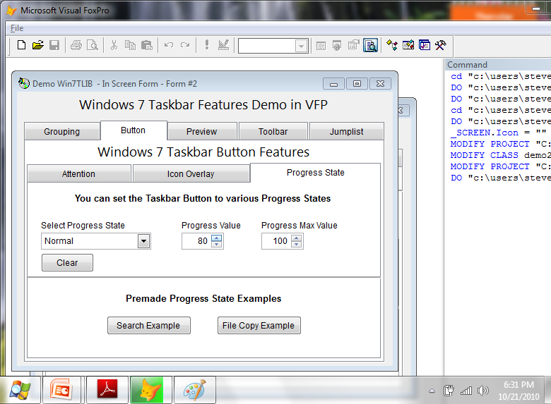
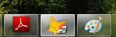
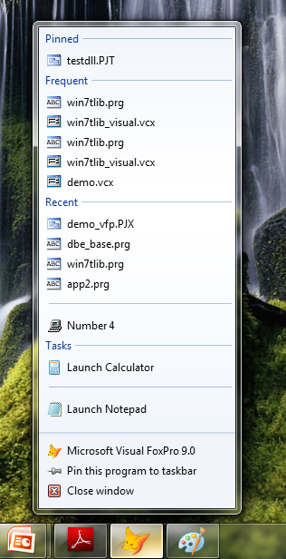
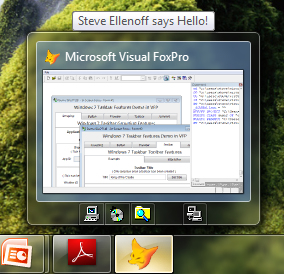
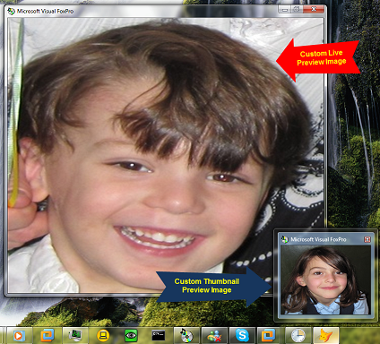

# Win7TLib ( Windows 7 Taskbar Library )
**Integrate Windows 7 Taskbar Functionality into your VFP Applications**

Project Manager: Steve Ellenoff (sellenoff AT hotmail.com)

## About
The Win7TLib project was created to allow VFP developers full integration of all the new Windows 7 Taskbar functionality into applications with minimal effort.

## Release History

Documentation - Released 2010-10-21
First public release of documentation (whitepaper from Southwest Fox 2010)

Demos & Samples - Released 2010-10-21
First public release of demos (from Southwest Fox 2010)

Ver 0.80 Alpha - Released 2010-10-16
First public release to VFPx site. Demo & Samples not included ( coming soon ).

## Screenshots

  
Custom Progress Bar in the Taskbar Button 

  
Custom Icon Overlay ( see the Floppy Drive Icon? )

  
Custom JumpList 

  
Custom Toolbar Buttons in the Thumbnail Preview Window

  
Custom Thumbnail & Live Peek Preview Images

## Demo

Place the demo folder in the same folder as your win7Tlib source folder as the sample code expects this.

For example, if you downloaded the source to C:\Win7TLib\Source, place the demo folder in C:\Win7TLib\Demo. It would look like this: 

    C:\Win7TLib
        Source	<Folder>
        Demo	<Folder>

To run demo interactively in VFP, CD to the demo's source folder and run from there.
For example to run the VCX demo's do:

    cd "c:\Win7TLib\demo\vcx\source\"

Then run the appropriate demo_xxx.prg, ie, demo_tdi.prg for the TDI example.

All code was tested on VFP 9 SP2 and Windows 7 32Bit & 64Bit.

## Thank you
Jim Nelson for sitting with me (seemed like all night) in the Business Center of the Legado Hotel during SWFOX 2010 to get my project pages put together and show me how VFPx works.

Doug Hennig for spending time during SWFOX 2010 to give me an initial review of how to setup my pages here.

Bo Durban for your suggestions many months ago on checking out the PrintWindow() API to solve some problems of capturing a window that did not have focus or was overlapped.